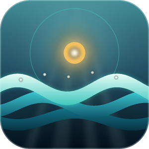
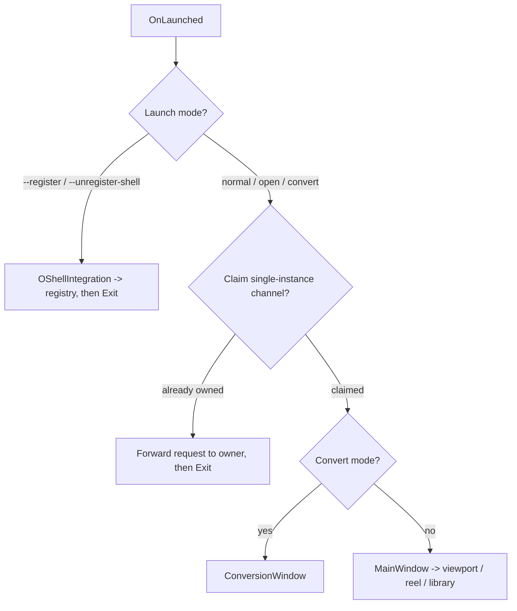

<div align="center">



# Talay

**A fast, free image viewer & converter for Windows.**

Open 60+ formats — including camera RAW — browse whole folders, organize a personal
image library, apply non‑destructive effects, and batch‑convert straight from the
Explorer right‑click menu.

[](https://en.cppreference.com/w/cpp/20)
[-0078D6?logo=windows&logoColor=white)](https://learn.microsoft.com/windows/apps/winui/winui3/)
[](#requirements)
[](LICENSE)

</div>

---

## Table of contents

- [About](#about)
- [Features](#features)
- [Supported formats](#supported-formats)
- [Architecture & design](#architecture--design)
- [Tech stack](#tech-stack)
- [Project layout](#project-layout)
- [Building from source](#building-from-source)
- [Installation](#installation)
- [Localization](#localization)
- [Roadmap](#roadmap)
- [License](#license)

---

## About

**Talay** is a native Windows desktop application for viewing and converting images.
It is built from the ground up in **modern C++20**, with **WinUI 3 / C++‑WinRT** for the
interface and the **Win32 API** for everything underneath it (shell integration,
single‑instance coordination, persistence, file I/O). The rendering path is
hardware‑accelerated **Direct2D** fed by a **WIC** / **FreeImage** decode stack, and the
user's library is persisted in **SQLite**.

The codebase (~30k lines) is deliberately split into two layers:

- **`framework/`** — an application‑agnostic C++ framework (`anka::*`) of reusable
  building blocks: rendering, decoding, effects, viewport math, dialogs, menus,
  database, settings, shell, clipboard, single‑instance channels. Nothing in here
  knows what Talay is.
- **the main folder** — the Talay application itself (`talay::*`): the image library,
  the conversion windows, the settings flow, the shell footprint, and the WinUI views
  that wire the framework pieces together.

This is a portfolio project: the goal is not just a working program, but a clean,
well‑documented, **SOLID** codebase that demonstrates design‑pattern fluency and
idiomatic modern C++.

---

## Features

### Viewing
- **High‑fidelity viewport** — fit‑or‑native open zoom, DPI‑true 100%, smooth
  cursor‑anchored wheel zoom, rotation, and panning clamped to image bounds.
- **Animated images** — GIF / MNG sequences play back frame‑accurately.
- **Folder reel** — step through every image in the containing folder with paginated
  thumbnails (10 per page); the active image is always scrolled into view.
- **Drag & drop** — drop a file onto the window to open it.
- **Recent files** — a most‑recently‑used list (max 6) under the File menu.
- **Image info** — dimensions, format, and metadata read straight from the file.

### Library
- A persistent, **SQLite‑backed image library** with favourites and fast in‑memory
  queries.
- **Filter & search** by format, source folder, favourite status, and name — the
  filter dropdowns are built dynamically from what's actually in the library.
- **Import / export** the whole library between machines.
- A **background reconciliation** sweep prunes entries whose files have vanished, off
  the UI thread, refreshing the views exactly once.

### Effects (non‑destructive)
- A CPU image‑effects engine with **four interchangeable pixel engines** —
  colour‑matrix, LUT / gamma, 3×3 convolution, and vignette — driving **12 effects**
  (grayscale, sepia, invert, brightness/contrast, sharpen, blur, edge detect, …).
- Effects preview live and never touch the original; **Save As** bakes the active
  effect into a new file in any supported format.

### Conversion
- Convert a single image or **batch‑convert** many at once, to any supported format.
- **"Convert with Talay"** Explorer context‑menu verb — right‑click any image (or a
  selection) and convert without opening the viewer.
- A dedicated conversion window that can absorb further files forwarded from new
  launches.

### System & shell integration
- **Single‑instance** application: the first process serves all UI; later launches
  (double‑clicked exe, file‑open, per‑file convert) forward their request over a named
  channel and exit.
- **File‑type associations** ("Open with" / Default Apps) for every supported format,
  toggleable from Settings.
- A self‑healing context‑menu verb that always re‑points at the current executable.
- **Print** images with page‑fitting, **share** via clipboard copy, and a themed
  **settings** dialog.

### Polish
- **Bilingual UI** — English and Turkish, auto‑selected from the OS display language
  and overridable in Settings.
- Custom **hover‑cursor** rules (pointer over clickable elements, grab / grabbing over a
  draggable viewport).
- Ships as a **self‑contained installer** that runs on a clean machine with no runtime
  prerequisites.

---

## Supported formats

Decoding is powered by **FreeImage** + **WIC**, covering **60+ extensions**, including
camera RAW:

```
Common      BMP · GIF · ICO · JPEG · PNG · TIFF · WEBP · TGA · PSD · DDS · HDR · EXR
Extended    CUT · IFF · LBM · JNG · JP2 · J2K · JXR/WDP/HDP · KOA · MNG · PBM/PGM/PPM
            PCD · PCX · PFM · PICT · RAS · SGI · WBMP · XBM · XPM · FAXG3
Camera RAW  3FR · ARW · CR2 · CRW · DNG · ERF · KDC · MEF · MOS · MRW · NEF · NRW
            ORF · PEF · RAF · RW2 · SR2 · SRF · RAW
```

The list lives in a single source of truth ([`ImageFormats.hpp`](ImageFormats.hpp)) that
the viewer, reel, converter, and shell registration all read — add a format once and
every consumer learns about it.

---

## Architecture & design

Talay is structured around a strict **framework ↔ application** boundary and a small,
consistent set of conventions.

### Conventions
- **`I`‑prefixed interfaces, `O`‑prefixed implementations** — every collaborator is
  programmed against an abstract interface; concrete `O…` classes are the only place a
  policy is decided. All entities descend from a common `anka::Core::Object::IObject`.
- **Namespaces mirror folders** — `anka::Graphics::Effect`, `anka::System::Shell`,
  `talay::Library`, `talay::Shell`, …
- **Pimpl everywhere** — public headers expose intent, not includes; implementation
  details and heavy dependencies stay in the `.cpp`. This keeps the framework's
  compile‑time surface small and its ABI stable.
- **Short functions** — functions are kept to roughly ten lines, each doing one thing.

### Design principles & patterns

The code is written against *Clean Code*, the *Effective C++ / STL* series, *C++ Coding
Standards*, and *Modern C++ Design*, applying **SOLID** throughout. Patterns in active
use include:

| Pattern | Where |
| --- | --- |
| **Repository + Facade** | `IImageLibrary` — the one seam the GUI uses to read / mutate the library |
| **Facade** | `IShellIntegration` — gathers the whole Windows shell footprint behind `install` / `uninstall` / `ensureVerb` / `applyFileTypes` |
| **Strategy** | `IFramingPolicy` (fit‑or‑native), `IPixelEffect` (4 engines), `ICursorRule` (hover behaviours) |
| **Specification** | `LibraryFilter` + entry specifications drive every library query |
| **Factory** | bitmap, surface‑bitmap, menu, and specification factories |
| **Model‑View‑Presenter** | `OSettingsPresenter`, `OSharePresenter`, `OSaveAsPresenter`, `OPrintPresenter` keep WinUI views thin |
| **Observer** | library‑changed callbacks and the instance‑channel message pump |
| **Singleton (Meyers)** | localization service, dialog service, shell registrar, format list |
| **Dependency Injection** | constructor‑injected interfaces and `std::function` callbacks; composition happens in `App.xaml.cpp` |

### Composition root

`App.xaml.cpp`'s `OnLaunched` is the single place where concrete pieces are assembled
and the launch is routed:



### Rendering pipeline

```
File ──▶ Decoder (FreeImage / WIC) ──▶ DecodedImage / ImageSequence
                                            │
                            BitmapFactory ──▶ ISurfaceBitmap (Still / Continuous)
                                            │
        OImageViewport (WinUI Canvas + WriteableBitmap) ◀── Renderer (Direct2D)
                 │  zoom · rotate · clamped pan at the XAML layer
                 ▼
            Screen   (GIF / MNG advanced by a DispatcherTimer)
```

---

## Tech stack

| Area | Technology |
| --- | --- |
| Language | **C++20** (MSVC v145 / VS 2026 toolset) |
| UI | **WinUI 3** via **C++/WinRT**, XAML, themed styles |
| Rendering | **Direct2D**, **DirectWrite**, **WIC**, `WriteableBitmap` |
| Image decoding | **FreeImage** (+ WIC) — 60+ formats incl. RAW |
| Persistence | **SQLite** (library, recent files) |
| Platform | **Win32 API** — shell registration, single‑instance mutex / channel, clipboard, known folders, printing |
| Build | MSBuild + NuGet (Windows App SDK, self‑contained) |
| Installer | **Inno Setup** — unpackaged, self‑contained `setup.exe` |

---

## Project layout

```
Talay/
├─ framework/                 # anka:: — reusable, application-agnostic C++ framework
│  ├─ Core/                   #   Object, Database (SQLite), IO, Localization,
│  │                          #   Paging, RecentFiles, Settings, Error handling
│  ├─ Graphics/               #   Renderer, Bitmap, Image (decoders), Effect,
│  │                          #   Conversion, Print, Resource
│  ├─ GUI/                    #   Viewport, Presentation, Dialog, Menu,
│  │                          #   DragDrop, Cursor
│  └─ System/                 #   Shell, Instance, Clipboard, Process, Time
│
├─ *.hpp / *.cpp              # talay:: — the application (flat in the main folder,
│                             #   grouped by filters in the .vcxproj)
│   ├─ App.xaml.*             #   composition root & launch routing
│   ├─ MainWindow.xaml.*      #   viewer, folder reel, library panel
│   ├─ ConversionWindow.xaml.*#   single & batch conversion
│   ├─ O…Library / O…Store    #   SQLite-backed image library + reconciler
│   ├─ O…Presenter            #   settings / share / save-as / print presenters
│   └─ O…ShellIntegration     #   Talay's Windows shell footprint
│
├─ Strings/                   # en-US & tr-TR .resw resources
├─ Styles/                    # XAML theme / control styles
├─ Assets/                    # icons & tiles
├─ Talay.iss                  # Inno Setup installer script
└─ Talay.sln / Talay.vcxproj  # solution & project (with filters)
```

> The application files are kept flat in the main folder and organized through
> **project filters** in the `.vcxproj`, while the reusable `framework/` lives in real
> subfolders so it can be lifted into other programs unchanged.

---

## Building from source

### Requirements

- **Windows 10 / 11 (x64)**
- **Visual Studio 2026** (or Build Tools) with:
  - *Desktop development with C++*
  - the **v145** platform toolset and a recent Windows 10 / 11 SDK
- The C++/WinRT and Windows App SDK NuGet packages (restored automatically)

### Build (Debug)

From a *Developer PowerShell*:

```powershell
& "C:\Program Files\Microsoft Visual Studio\18\Community\MSBuild\Current\Bin\MSBuild.exe" `
    .\Talay.sln /t:Restore,Build /p:Configuration=Debug /p:Platform=x64 /v:minimal
```

Use `/t:Build` (dropping `Restore`) for incremental rebuilds once packages are
restored. You can also just open `Talay.sln` in Visual Studio and press **F5**.

### Release + installer

```powershell
MSBuild .\Talay.sln /t:Build /p:Configuration=Release /p:Platform=x64
& "$env:LOCALAPPDATA\Programs\Inno Setup 6\ISCC.exe" .\Talay.iss
```

The Release build is **self‑contained** (`WindowsAppSDKSelfContained=true`) and
self‑trims its output to a runtime‑only folder (≈ 61 MB) that Inno Setup packages into
`setup.exe`.

---

## Installation

Run the generated **`setup.exe`**. It installs Talay (Start‑menu shortcut, optional
desktop icon), bundles the Windows App SDK runtime so no prerequisites are needed, and
registers the file‑type associations and the *"Convert with Talay"* context‑menu verb.
Uninstalling removes all of it cleanly.

---

## Localization

The UI ships in **English** and **Turkish**. Strings live in `.resw` resources bound at
the XAML layer via `x:Uid`, with code‑behind lookups going through a single
`anka::Core::Localization` facade. The language is auto‑selected from the OS display
language on first run and can be overridden in Settings (the choice survives a restart).

---

## Roadmap

- [x] Viewer, folder reel, and full image library
- [x] Effects engine + Save As
- [x] Single & batch conversion with shell integration
- [x] Recent files, share, print, settings
- [x] EN / TR localization and self‑contained installer
- [ ] **Thumbnail disk cache** for faster library / reel rendering

---

## License

Released under the [MIT License](LICENSE). © 2026 AnkA Interactive.
